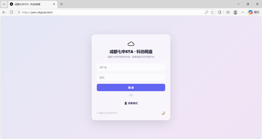
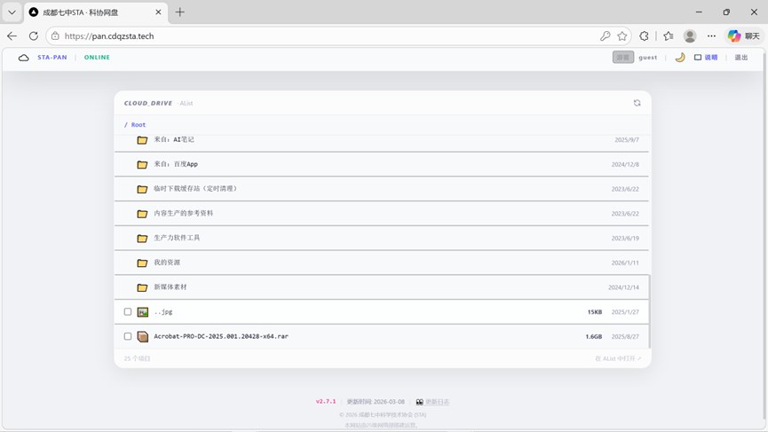
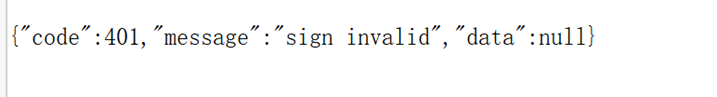
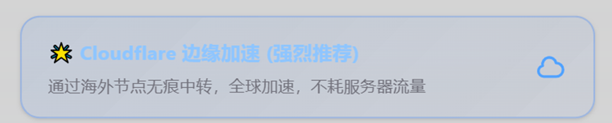
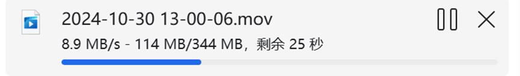
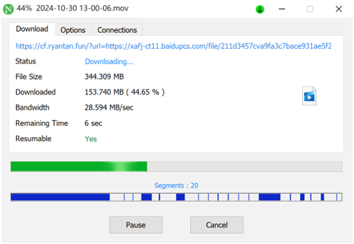
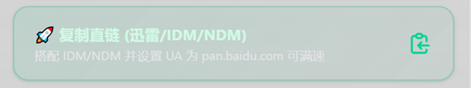
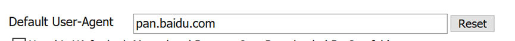
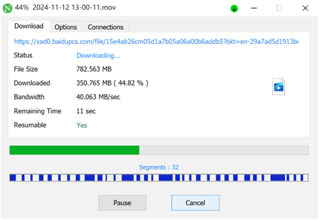
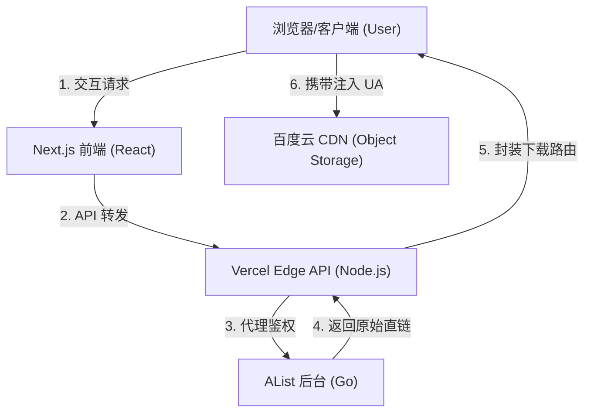

# 百度网盘 New ProMax 教程 v2

> [!IMPORTANT]
> **核心提升**：本站点的最大改进旨在**彻底解决手机端同学无法直接下载大文件（>20MB）的问题**。对于电脑端用户，您依然可以沿用传统的 IDM/Alist 直链方案。
>
> **连接方式**：这是“自定义前端调用 AList API”的方案：服务端用 **AList Base URL + `ALIST_USERNAME/ALIST_PASSWORD`** 换取 token，再调用 AList `/api/fs/*`；不需要对方数据库权限，也不是把别人的 AList “挂载进你的 AList”。


## 一、 基本信息
- **登录新版网址**：[https://pan.cdqzsta.tech](https://pan.cdqzsta.tech)
- **AList 原始接口**：
    - 访问网址 (IPv6)：`https://alist.0d000721.ltd:45567`
    - 访问网址 (IPv4)：`https://frp-gap.com:37492`
    > [!TIP]
    > 如果你不知道该用哪一个，请优先尝试 IPv6，不行再换用 IPv4。

## AList 连接过程（理解原理用）

后端连接 AList 的过程可以压缩为 3 步：

1. 确认 **AList Base URL**（能拼出 `/api/auth/login` 的根地址），例如 `https://alist.example.com`。
2. 用 `ALIST_USERNAME/ALIST_PASSWORD` 调用 AList `POST /api/auth/login` 换取 token（服务端完成，前端拿不到账号密码）。
3. 携带 `Authorization: <alistToken>` 调用 AList `/api/fs/list`、`/api/fs/get`、`/api/fs/put` 等接口。

## 二、 登录
- **游客**：小登们点击“以游客身份登录”按钮直接进入。
- **老登**：如果你拥有专属账号，可以使用账号密码登录。
- **外观切换**：点击右下角的“月亮/太阳”图标即可开启或关闭深色模式（玻璃拟态效果在深色模式下更佳）。


## 三、 页面简介

登录后进入主界面，右上角有简单说明。操作逻辑与普通网盘一致，支持文件浏览、预览与下载。

## 四、 下载逻辑详解（重点）
由于百度网盘对 **≥20MB** 的文件会强制验证请求头 `User-Agent: pan.baidu.com`，普通浏览器或手机端直接下载会报错 403。

为此，本站设计了以下逻辑：

> [!IMPORTANT]
> **点击下载后请耐心等待**。系统正在后台解析获取最优直链，并非网页卡死。

### 1. 🔹 小文件 ( < 20MB )
- **触发方式**：直接在列表中点击。
- **特点**：触发浏览器原生下载，直链提取，速度极快，无需配置。

### 2. 🔹 大文件 ( ≥ 20MB )
点击后会弹出 3 种优化下载方案：

- **☁️ Cloudflare 边缘加速（强烈推荐，手机端福音）**

    - **原理**：通过 Cloudflare Workers 做“边缘代理”：把真实直链作为 `?url=` 传给 Worker，由 Worker 去请求直链并把响应流转回浏览器。
    - **关键实现点**（按 Worker 代码行为）：
      - 命中 `baidu.com/baidupcs.com` 时强制注入 `User-Agent: pan.baidu.com`。
      - 透传 `Range` 请求头，保证多线程分块下载/断点续传生效。
      - `redirect: 'follow'` 自动跟随百度 302 重定向。
      - 返回时开放 CORS：`Access-Control-Allow-Origin: *`，并 `Expose-Headers: *`，让网页端能读到进度相关响应头。
    - **优势**：完美解决手机端无法修改 UA 的痛点。无需任何配置，点击即下。由于 CF 节点带宽充裕，基础速度可达 9MB/s 以上。
    
    - **注意**：短时间内（1分钟内）多次发起请求可能会触发布发商限速。


- **🚀 复制直链（最高速选择）**

    - **原理**：直接暴露真实的百度原生 CDN 链接（含时效签名）。
    - **配合要求**：**必须**配合桌面端多线程工具（如 NDM/IDM），且必须在软件设置内手动加入 `User-Agent: pan.baidu.com`。
    
    - **优势**：满速方案，最高可达 50MB/s+（取决于你的实际带宽）。
    

- **🔥 服务器中转下载（备用）**

    - **原理**：由 STA 后端服务器直接拉取百度流量并转发至你的设备。
    - **优缺点**：极其稳定且速度尚可，但由于服务器月流量有限（限额 7GB/月），建议仅在上述方案均失效时作为兜底使用。

## 五、 文件预览
目前支持以下格式的在线预览：
- **图片**：jpg, jpeg, png, gif, webp, svg, bmp, ico
- **视频**：mp4, webm, ogg, mov
- **文本/代码**：txt, md, log, json, csv, xml, html, css, js, ts, tsx, py, java, c, cpp, h, yaml, yml, ini, cfg, conf, sh, bat, sql, go, rs, rb, php, swift, kt
- **文档**：PDF

## 六、 技术原理 

本项目并非简单的 UI 壳子，而是一套基于 **Next.js App Router** 构建的轻量化中转发网关，旨在通过技术手段突破百度网盘的各类下载限制。

### 1. 技术架构全景
项目的核心任务是处理 **AList 后端** 与 **最终浏览器/客户端** 之间的跨域、鉴权与 UA 校验冲突。



### 2. AList 连接与代码实现
本站的 `src/app/api/alist/route.ts` 承担了鉴权桥接任务：
- **静默授权**: 前端利用环境变量中的 `ALIST_PASSWORD` 与 AList 握手获取 `token` 并缓存，无需用户感知。
- **请求代理**: 前端调用 `/api/alist`（Action: `get`）时，后端会拦截并代为向 AList 请求文件的真实原始 URL（含临时签名）。
- **权限透传**: 整合了用户角色校验，确保只有在后端验证过用户 Token 后，才会下发对应的 AList 操作指令。

### 3. 下载加速与中转方案
- **Cloudflare 边缘加速**: 利用 Cloudflare 全球分布的边缘节点，通过边缘脚本（Workers）在流量经过时动态补全百度所需的 `User-Agent` 与 `Referer`。
- **服务器中转 (Server Proxy)**: 
    ```typescript
    // 核心实现原理：流式转发
    const baiduRes = await fetch(rawUrl, {
      headers: { 'User-Agent': 'pan.baidu.com' }
    });
    return new Response(baiduRes.body, { headers: { ... } });
    ```

---

## 七、 常见问题 (Q & A)

### 🔌 连接方式相关

> [!NOTE]
> **Q0: 这是“把别人的 AList 挂载到你自己的 AList”吗？**
> **A**: 不是。这里是“自定义前端调用 AList API”的模式：用 AList 的 Base URL 调 `/api/auth/login` 换 token，再调 `/api/fs/*`。不需要对方数据库权限。

> [!TIP]
> **Q0.1: 我应该填哪个 URL？AList 的网页地址还是接口地址？**
> **A**: 用 **AList Base URL**（根地址）：能拼出 `.../api/auth/login` 的那个。不要用带页面路径/参数的 URL。


### 🚀 下载与速度相关

> [!NOTE]
> **Q1: 为什么下载大文件直接报错 403 / 手机下载失败？**
> **A**: 百度对 ≥20MB 的文件有严格的 `User-Agent` 校验。手机浏览器无法修改 UA，所以直接下载会失败。
> - **解决：** 手机端请务必选择 **“Cloudflare 边缘加速”** 模式，它会自动帮你补全 UA。

> [!TIP]
> **Q2: 三种下载模式我该选哪一个？**
> **A**: 
> - **手机端：** 无脑选 **“Cloudflare 边缘加速”**，兼容性最好。
> - **电脑端：** 追求极致速度选 **“复制直链”** + NDM/IDM 工具（需设置 UA 为 `pan.baidu.com`）。
> - **所有方案失效时：** 尝试 **“服务器中转”** 作为兜底。

> [!NOTE]
> **Q2.1: 为什么 Cloudflare 方式能“看到下载进度/速度”？**
> **A**: Worker 会对返回响应加上 `Access-Control-Expose-Headers: *` 并允许跨域，这样网页端可以读取 `Content-Length/Content-Range` 等头字段来计算进度；同时它透传 `Range`，多线程分块下载也能工作。

> [!WARNING]
> **Q3: 百度网盘限速了，使用这个能“跑满”吗？**
> **A**: 本站并非破解工具（不提供 SVIP 账号）。我们可以解决“报 403 无法下载”的问题，但最终下载速度上限依然受限于百度对你账号本身的配额。

### 🛡️ 安全与隐私相关

> [!NOTE]
> **Q4: 这个网盘是挂载在社团服务器上的吗？**
> **A**: 不是。它是一个 **AList 协议解析的 ProMax 升级版**。它部署在云端节点，通过技术手段将百度网盘的原始资源流进行“实时翻译”和“伪装转发”，不占用本地硬盘。

### ⚙️ 技术与限制相关

> [!CAUTION]
> **Q5: 服务器中转下载有流量限制吗？**
> **A**: **是的。** 由于服务器成本极高，中转模式每月仅有 **7GB** 的共享总配额。请节约使用，仅在其他方案失效时启用。

> [!IMPORTANT]
> **Q6: 为什么有些 AList 里的文件在这个界面看不见？**
> **A**: 本站遵循 AList 的权限隔离逻辑。仅展示在 AList 后台中设置了“公开访问”且未被隐藏的路径。


---
*© 成都七中科学技术协会 (STA).*
