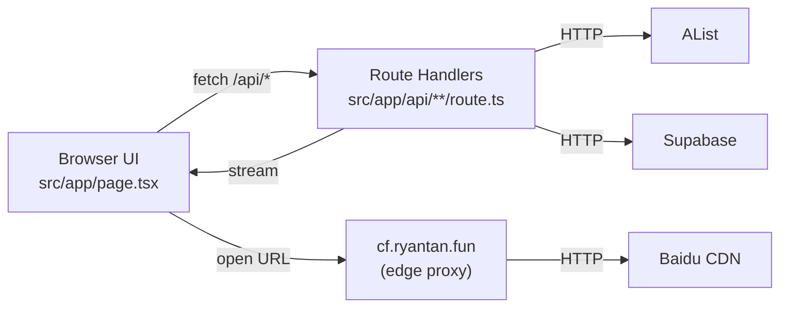
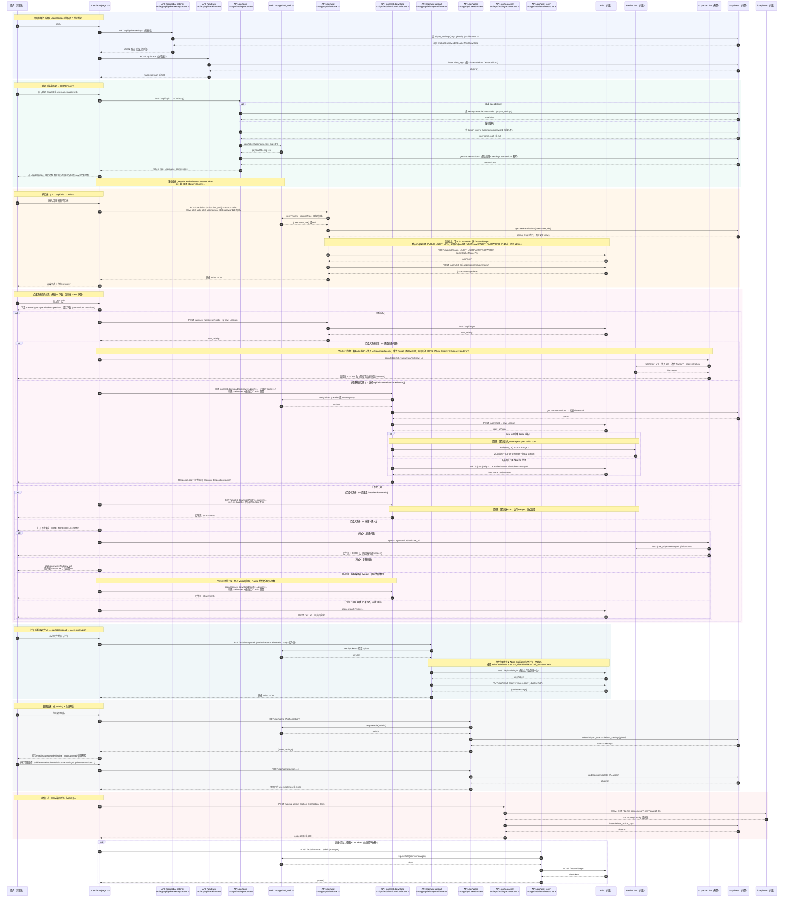

# baidu-pan-alist：项目技术逻辑说明书

覆盖范围：只描述 `baidu-pan-alist/` 目录内实现。目标是让读者在不读源码细节的情况下，理解“它怎么连上 AList、怎么鉴权、怎么把文件变成可预览/可下载的响应、以及哪里会出问题”。

连接结论先说清：本项目不是“把别人的 AList 挂载到你自己的 AList”（场景一），而是 **自定义前端/应用调用**（场景二）的实现。它通过 **AList Base URL**（能拼出 `/api/auth/login` 的根地址）+ **服务端账号密码**（`ALIST_USERNAME/ALIST_PASSWORD`，不要求一定是 admin）换取 AList token，再调用 AList 的 `/api/fs/*`。前端不会直接拿到 AList 账号密码。


### 01. 项目要解决的具体问题（为什么会存在“多种下载方式”）

百度网盘常见限制之一：当文件达到一定体积（本项目阈值写死为 `20MB`），下载链路会更严格地校验请求头， `User-Agent: pan.baidu.com`。普通手机浏览器无法方便地改 UA，于是出现现象：

- 电脑端用下载器（IDM/NDM）能下；手机端浏览器点直链常见 403。
- 预览/下载在不同域名上触发跨域（CORS）或防盗链，浏览器端直接 `fetch(raw_url)` 会失败。

本项目的核心做法是把“拿直链 → 变成可下载/可预览的响应”放到同域的后端接口里，并在需要时补齐 UA 或走边缘代理。

### 02. 系统整体结构（谁在跟谁说话）

系统跨 5 个角色工作：

- 浏览器 UI：`src/app/page.tsx`，显示目录、按钮、弹窗；把 token 放在请求头或 query；决定走哪种下载策略。
- Next.js Route Handlers（后端接口）：`src/app/api/**/route.ts`，做鉴权、权限、代理、流式转发。
- AList：提供网盘抽象层（列目录、拿 raw_url、签名下载、上传 put）。
- Supabase：持久化用户/设置/权限覆写/日志。
- 第三方边缘代理：`https://cf.ryantan.fun/?url=...`，用于某些“百度大文件 + 浏览器受限”的链路兜底。



### 02.1 AList 连接过程（“URL + 账号密码”怎么用）

把“连接 AList”拆成 3 步就够用：

1. 确认 AList Base URL：例如 `https://alist.example.com`（它必须能拼出 `https://alist.example.com/api/auth/login`）。
   - <span class="hl hl-amber">不要用</span>“AList 网页某个页面的 URL（带路径/参数）”，后端要的是根地址。
2. 在本项目服务端配置 AList 凭据：
   - `ALIST_USERNAME` / `ALIST_PASSWORD`
3. 后端换 token 并代理调用：
   - 用账号密码请求 AList `POST /api/auth/login` 得到 AList token。
   - 后续调用 AList `POST /api/fs/list`、`POST /api/fs/get`、`PUT /api/fs/put` 等时，把 token 放到 `Authorization` 头里。

代码对应：

- 换 token 的动作发生在 `src/app/api/alist/route.ts`、`src/app/api/alist-download/route.ts`、`src/app/api/alist-upload/route.ts`（不同接口各自会登录 AList）。
- AList Base URL 默认来自环境变量 `NEXT_PUBLIC_ALIST_URL`（后端也读取它）；UI 还支持通过请求头 `x-alist-url/x-alist-username/x-alist-password` 临时覆盖目标实例（用于调试/多目标）。


### 03. 部署在哪里、每个平台在做什么（按代码可推导的事实）

代码层面能确定的点：

- 项目是 Next.js（`next@16.1.6`）+ React（`react@19.2.3`）。
- 后端接口使用了 `node:crypto`（`src/app/api/_auth.ts`），因此这些接口必须运行在 **Node runtime**（不能当 Edge Function 跑）。
- 下载/上传依赖 Node 的 `fetch()` 能力，并使用流式转发；上传还显式写了 `duplex: 'half'`（`src/app/api/alist-upload/route.ts`）。

因此部署形态通常是两类（两类都成立）：

- Vercel / 类似平台：部署 Next.js 应用；Route Handlers 作为 Node Serverless Functions 运行。
- 自建 Node 服务器：`next build && next start` 方式跑；Route Handlers 作为 Node HTTP 服务的一部分运行。

外部平台的职责固定不变：

- AList：真正知道“某个 path 对应什么存储提供商、对应哪个 raw_url/sign”的系统。
- Supabase：数据库与表访问策略（RLS）决定“哪些接口能读写到数据”。
- cf.ryantan.fun：对浏览器端不可控的请求头/跨域问题提供兜底（属于外部依赖，不在本仓库内）。

### 04. 目录结构与关键文件（先把“每个文件干嘛”对齐）

### 04.1 `src/app/page.tsx`（UI + 状态机 + 下载策略路由）

主要职责：

- 登录后把 `BDPAN_TOKEN/ROLE/USERNAME/PERMS` 写入 LocalStorage，并在所有 API 请求里带上。
- 调用 `/api/alist` 列目录、拿文件元信息。
- 点击文件时根据 provider/文件大小选择下载路径：
  - 百度 + 小文件：走 `/api/alist-download`（服务端注入 UA 更稳）。
  - 百度 + 大文件：弹窗让用户选“边缘代理 / 复制直链 / 服务器中转 / 302 直跳”。
  - 其他 provider：走直链或走 `/api/alist-download`（主要为 CORS/防盗链兜底）。
- 在线预览：先拿直链，再选择“走 cf 代理”或“走本地 `/api/alist-download?preview=1`”。

### 04.2 `src/app/api/_auth.ts`（自签 Token：发放与验证）

提供：

- `signToken(username, role)`：把 `{exp, username, role}` 做 base64url，再用 HMAC-SHA256 签名。
- `verifyToken(authHeader)`：校验 `Authorization: Bearer <token>`、签名、过期时间。
- `requireRole(authHeader, ...roles)`：在验证 token 的基础上加“角色白名单”。

### 04.3 `src/lib/users.ts`（角色/权限位 + Supabase 持久化）

提供：

- 角色：`admin | manager | guest`
- 权限位：`view/download/upload/delete/rename/preview`
- 默认权限 + 覆写合并：从 Supabase `bdpan_settings.key='global'` 读取 `value.permissions[username]`，用 `{...默认, ...覆写}` 合并。
- 用户 CRUD：`bdpan_users` 表（用户名、密码、角色）。
- 全局设置：`bdpan_settings` 表（`enableGuestMode/permissions/disableThirdDownload`）。

### 04.4 `src/app/api/*/route.ts`（后端接口全集）

接口清单（按目录）：

- `api/login`：登录与签发 token。
- `api/alist`：统一代理 AList FS 接口（list/get/mkdir/remove/rename）并做权限裁剪。
- `api/alist-download`：下载/预览代理（UA 注入 + Range + 流式转发）。
- `api/alist-upload`：上传代理（流式透传到 AList）。
- `api/users`：管理接口（仅 admin）。
- `api/global-settings`：公开安全设置（无鉴权，只返回有限字段）。
- `api/log-action`：动作日志（Supabase）。
- `api/track`：访问日志（Supabase）。
- `api/alist-token`：返回 AList token（仅 admin/manager；UI 不依赖它）。

### 05. 必要概念解释（穿插就够用，不讲百科）

### 05.1 Next.js App Router / Route Handler 是什么（对照到本项目）

- 页面：`src/app/page.tsx` → 浏览器访问 `/` 看到的内容。
- 接口：`src/app/api/alist/route.ts` → 浏览器访问 `/api/alist` 触发。

你可以把它理解成：Next.js 把“前端页面”和“后端接口”都装在一个项目里，按文件夹自动生成路由。

### 05.2 HTTP 请求里最常见的 4 个元素（本项目会反复出现）

- URL：请求路径（如 `/api/alist-download`）。
- Method：GET/POST/PUT。
- Headers：额外信息（token、Range、User-Agent）。
- Body：数据本体（JSON 或文件二进制）。

### 05.3 CORS 是什么（为什么“预览必须走代理”）

浏览器为了安全，不允许网页随便读取别的域名的内容。很多直链资源（网盘、CDN）对跨域读取有限制。

解决方式之一：让同域的后端接口去请求外部资源，再把内容返回给浏览器。浏览器只看到“同域接口”，就不会触发 CORS 拦截。这就是 `/api/alist-download?preview=1` 的存在意义之一。

### 05.4 Range 是什么（为什么下载器会开很多连接）

`Range: bytes=0-1048575` 表示“只要文件的一段”。下载器为了加速，会把文件分段并发下载（很多个 Range 请求）。

后端必须正确透传 `Range`，并把 `Content-Range` 回写给客户端，否则断点续传会坏掉。

### 05.5 “流式转发”是什么意思（为什么能代理大文件）

服务端拿到上游 `Response.body`（一条流）后直接返回给下游，不把文件读进内存：

- <span class="hl hl-green">优点</span>：内存占用低，能代理很大的文件。
- <span class="hl hl-amber">代价</span>：连接保持时间长，平台对并发连接数/带宽的限制会更明显。

### 06. 功能板块与技术点（按“功能 → 入口文件 → 数据流/算法/边界”展开）

### 06.1 登录与会话（`POST /api/login` + HMAC Token）

入口：

- `src/app/api/login/route.ts`
- `src/app/api/_auth.ts`

两种登录：

- 游客：`{ "guest": true }`，先读取全局设置 `enableGuestMode`，允许则签发 `role=guest` 的 token。
- 账号密码：查 Supabase `bdpan_users` 表（等值匹配 `username/password`），签发该用户 `role` 的 token。

Token 结构（关键点是“服务端可验证，无需数据库 session”）：

```ts
// src/app/api/_auth.ts（结构摘录，关键注释保留）
// payload: { exp, username, role }
// token = base64url(payloadJSON) + "." + HMAC_SHA256(payloadB64, ADMIN_TOKEN_SECRET).hex
const TOKEN_TTL_MS = 8 * 60 * 60 * 1000; // 8 小时有效期
```

边界与坑位：

- Token 保存在 LocalStorage：一旦发生 XSS，token 可被读取并在有效期内重放。
- `ADMIN_TOKEN_SECRET` 如果未设置，会回退到硬编码默认值：<span class="hl hl-red">可伪造 token</span> 的风险会非常高（见 08.1）。

### 06.2 权限系统（角色 + 权限位 + 覆写）

入口：

- `src/lib/users.ts`
- `src/app/api/_auth.ts`（负责“你是谁”）
- `src/app/api/alist/route.ts`、`src/app/api/alist-download/route.ts`（负责“你能干什么”）

权限如何生效（按调用链）：

- `/api/alist`：对 list/get/mkdir/remove/rename 逐项判断权限位。
  - root（`/`）总允许浏览；子目录才检查 `view`。
  - 写操作分别检查 `upload/delete/rename`。
- `/api/alist-download`：强制检查 `download`，否则直接 403。
- UI 自己也做了一层判断（例如没有 preview 权限就不打开预览），但真正的硬门槛在后端接口。

### 06.3 AList 连接与代理（`POST /api/alist`）

入口：`src/app/api/alist/route.ts`

它做三件事：

- 验证本系统 token：没有 `Authorization: Bearer ...` 就 401。
- 换取 AList token：用 `ALIST_USERNAME/ALIST_PASSWORD` 调 AList `/api/auth/login`，把返回 token 缓存在内存 Map 里（47h 过期）。
- 代理 AList FS API：把 UI 的 action 映射到 AList endpoint。

UI 请求体（代码实际读取的字段）：

```ts
// src/app/api/alist/route.ts（按读取字段整理）
type Body = {
  action: 'list'|'get'|'mkdir'|'remove'|'rename';
  path?: string;
  dir_name?: string;    // mkdir
  name?: string;        // remove（单个）
  names?: string[];     // remove（多个）
  newName?: string;     // rename
};
```

“自定义 AList 实例”（调试/多目标）的通道：

- `x-alist-url`
- `x-alist-username`
- `x-alist-password`

边界与坑位：

- AList token 缓存是“单实例内存 Map”：Serverless 冷启动或扩容会让缓存丢失，出现瞬时“登录 AList”突增。
- 缓存过期写死为 47h，不读取 AList token 的真实失效时间；如果 AList 端提前失效，会出现一段时间的 500（直到重新 login）。
- `list` 请求固定 `per_page: 0`（全量返回），目录很大时 JSON 会很大，网络与解析都会慢。

### 06.4 下载与预览（`GET /api/alist-download` + UI 的“多方式下载”）

入口：

- UI：`src/app/page.tsx`（决定策略、弹窗、拼 URL）
- 后端：`src/app/api/alist-download/route.ts`（真正干活：Range/UA/流）

#### 06.4.1 `/api/alist-download` 的后端算法（按代码执行顺序）

1. 解析 query：
   - `path` 必填
   - `preview=1` → inline
   - `token`（可选）：用于 GET 下载场景把 token 放 query（因为 `<a>` 无法自定义 header）
   - `c`（可选）：自定义 AList 配置 base64
2. 验证本系统 token（header 或 token query）。
3. 检查 `download` 权限位。
4. 登录 AList 换 token（47h 内存缓存）。
5. 调 AList `/api/fs/get` 拿到 `raw_url/sign`。
6. 选择上游：
   - 若 `raw_url` 域名命中 `baidupcs.com|baidu.com`：直接 `fetch(raw_url)` 并注入 `User-Agent: pan.baidu.com`；透传 `Range`。
   - 否则：构造 `${ALIST_URL}/p${path}?sign=...`，携带 `Authorization: <alistToken>`；透传 `Range`。
7. 把上游 `Response.body` 直接返回给浏览器（流式转发），并复制必要响应头。

#### 06.4.2 UI 的下载方式（把“点按钮”映射到“走哪条链路”）

UI 内部阈值：`SIZE_THRESHOLD = 20 * 1024 * 1024`（20MB）。

百度大文件会弹出下载弹窗。项目界面上能看到的方式，本质对应三条技术路线（外加一个“裸直跳”）：

- <span class="hl hl-blue">方式 A：边缘代理</span>（Cloudflare/边缘节点）
  - UI 直接打开 `https://cf.ryantan.fun/?url=<raw_url>`。
  - 技术点：把原始直链包进一个代理 URL，让边缘节点代替浏览器去请求百度 CDN，并补齐/改写必要头字段，同时绕开浏览器跨域限制。
  - <span class="hl hl-amber">按你给出的 Worker 代码，边缘代理真实做了这些事</span>：
    - 命中 `baidu.com/baidupcs.com` 时强制设置 `User-Agent: pan.baidu.com`。
    - 透传 `Range` 请求头，保证“多线程分块/断点续传”能工作。
    - `redirect: 'follow'` 跟随百度 302 跳转。
    - 对返回响应开放 CORS：`Access-Control-Allow-Origin: *`，并 `Expose-Headers: *`，让网页端能读到 `Content-Length/Content-Range` 等头字段来计算进度。
  - 代价：依赖外部域名与其可用性；发生限速/封禁时会直接影响体验。

- <span class="hl hl-green">方式 B：复制直链</span>（把 raw_url 交给下载器）
  - UI 调 `/api/alist` 的 `get` 拿 `raw_url`，写入剪贴板。
  - 技术点：让用户使用 IDM/NDM 这类可配置 UA 的客户端，并手动设定 `User-Agent: pan.baidu.com`。
  - 特征：通常速度最好，但对手机端不友好（因为手机端缺少同等能力的下载器或配置入口）。

- <span class="hl hl-amber">方式 C：服务器中转</span>（本项目后端代理下载）
  - UI 打开 `/api/alist-download?path=...&token=...`。
  - 技术点：服务端 fetch 百度 CDN 并注入 UA，靠流式转发把内容送回浏览器；支持 Range，下载器可多线程。
  - 特征：会消耗部署端的带宽与连接数；UI 支持用全局设置 `disableThirdDownload` 禁用该按钮。

- <span class="hl hl-gray">方式 D：302 直链跳转（不补 UA）</span>
  - UI 直接打开 AList 的 `/d` 链接。
  - 技术点：几乎没有“技术点”，就是裸直跳；大文件可能被百度拦截（403）。

#### 06.4.3 在线预览的两条链路（为什么有时走 cf，有时走本地代理）

UI 预览会先拿到直链（`raw_url`），然后：

- 百度大文件：预览 URL 改写为 `https://cf.ryantan.fun/?url=...`。
- 其他情况：预览 URL 改写为 `/api/alist-download?preview=1&path=...&token=...`，让浏览器只访问同域接口，规避 CORS。

文本预览额外限制：UI 对 >2MB 文本直接提示“无法在线预览”，避免浏览器卡顿。

### 06.5 上传（`PUT /api/alist-upload`：浏览器 → 本项目 → AList）

入口：`src/app/api/alist-upload/route.ts`

关键点：上传必须走流式透传，避免把文件读进内存。

```ts
// src/app/api/alist-upload/route.ts（语义等价摘录）
// 重点：request.body 直接转发给 AList；duplex 允许 streaming upload
await fetch(`${config.url}/api/fs/put`, {
  method: 'PUT',
  headers: {
    'Authorization': alistToken,
    'File-Path': filePath,            // UI 按 segment encode 后再拼接
    'Content-Type': contentType,
    ...(contentLength ? { 'Content-Length': contentLength } : {}),
  },
  body: request.body,
  duplex: 'half',
});
```

边界与坑位：

- 每次上传都会去 AList `/api/auth/login` 换 token（这里没有复用缓存），并发上传时会放大登录压力。
- 部署平台如果不支持 `duplex:'half'` 的 streaming upload，会直接抛错。

### 06.6 管理面板与全局开关（`/api/users`、`/api/global-settings`）

入口：

- `src/app/api/users/route.ts`（管理接口，仅 admin）
- `src/app/api/global-settings/route.ts`（公开设置，无鉴权）

管理接口做的事情：

- 维护用户（增删改角色）。
- 修改全局设置（是否允许游客、是否禁用某下载方式）。
- 覆写某个用户的权限位（写到 `bdpan_settings.global.permissions[username]`）。

公开设置只返回两项（为了让 UI 决定按钮状态）：

- `enableGuestMode`
- `disableThirdDownload`

### 06.7 日志与统计（`/api/log-action`、`/api/track`）

入口：

- `src/app/api/log-action/route.ts`：动作日志（下载/预览/删除/上传等）。
- `src/app/api/track/route.ts`：访问日志。

技术点：

- 两者都通过 `@supabase/supabase-js` 写入 Supabase 表。
- `log-action` 会尝试从 `x-forwarded-for/x-real-ip` 取 IP，并调用 `http://ip-api.com/json/<ip>` 获取地理位置（失败会忽略）。

边界与坑位：

- 外部定位接口是 HTTP 明文并且可能变慢/被拦截，会增加接口延迟。
- 这两个接口在代码层面不做鉴权，数据可信度取决于 Supabase RLS/策略。

### 07. 接口清单（参数、默认值、返回、错误码）

### 07.1 `POST /api/login`

请求体：

```jsonc
{ "guest": true }
// 或
{ "username": "alice", "password": "******" }
```

成功响应（字段齐全时）：

```jsonc
{
  "token": "payloadB64.sigHex",
  "role": "guest|manager|admin",
  "username": "guest|alice",
  "permissions": { "view": true, "download": true, "upload": false, "delete": false, "rename": false, "preview": true }
}
```

失败（HTTP status）：

- 400：缺字段（用户名/密码）
- 401：用户名或密码错误
- 403：游客模式被关闭
- 500：服务端异常

### 07.2 `POST /api/alist`

请求头：

```http
Authorization: Bearer <bdpanToken>
Content-Type: application/json
```

请求体（action + 参数）：

```jsonc
{ "action": "list", "path": "/" }
{ "action": "get", "path": "/a/b/c.txt" }
{ "action": "mkdir", "path": "/a/b", "dir_name": "newdir" }
{ "action": "remove", "path": "/a/b", "names": ["1.txt","2.txt"] }
{ "action": "rename", "path": "/a/b/1.txt", "newName": "x.txt" }
```

响应：

- 成功：透传 AList JSON（通常 `code===200`）。
- 失败：
  - 401：未登录
  - 403：权限不足
  - 400：参数/action 不合法
  - 500：AList 登录或代理异常

### 07.3 `GET /api/alist-download`

Query：

- `path: string`（必填）
- `preview?: '1'`
- `token?: string`（可选）
- `c?: string`（可选，base64 自定义 AList 配置）

请求头：

- `Authorization?: Bearer <token>`（没传 token query 时使用）
- `Range?: bytes=...`

响应：

- 200/206：文件流（`Content-Disposition` 根据 `preview` 决定 inline/attachment）。
- 400：缺 path（JSON `{error}`）
- 401/403/500：纯文本错误（便于浏览器直接显示）

### 07.4 `PUT /api/alist-upload`

请求头（关键字段）：

- `Authorization: Bearer <bdpanToken>`
- `File-Path: string`（必填，UI 会做分段编码）
- `Content-Type`、`Content-Length`（建议提供）

请求体：文件二进制流。

响应：透传 AList `/api/fs/put` JSON（成功通常 `code===200`）。

### 08. 边界情况与故障定位（现象 → 根因 → 看哪里）

### 08.1 现象：登录后突然“谁都能当管理员”

根因之一：`ADMIN_TOKEN_SECRET` 未配置时会用硬编码默认值（`src/app/api/_auth.ts`）。这会让 token 可被伪造。<span class="hl hl-red">属于严重风险</span>

定位点：

- 检查运行环境是否真的注入了 `ADMIN_TOKEN_SECRET`。
- 检查是否有人在客户端构造 `Authorization: Bearer ...`。

### 08.2 现象：根目录能进，子目录提示无权浏览

根因：`/api/alist` 对 root 放行，子目录才检查 `view`。

定位点：

- 看 `/api/login` 返回的 `permissions.view`。
- 看 `bdpan_settings.global.permissions[username].view` 是否覆写为 false。

### 08.3 现象：手机端大文件 403；边缘代理能下；复制直链用 IDM 也能下

根因：百度对大文件更依赖 UA 校验，手机端无法稳定改 UA；边缘代理/服务器中转替你补齐了 UA；IDM 需要你手动设置 UA。

定位点：

- 看 UI 是否弹出“百度大文件下载弹窗”（说明已识别 provider/大小）。
- 服务器中转失败时看 `/api/alist-download` 返回的文本错误（包含上游 status/截断信息）。

### 08.4 现象：预览失败，但下载正常

根因常见组合：

- 预览会触发 CORS（UI 需要用 JS 读取内容，而不是浏览器下载）。
- 文本预览有 2MB 限制（UI 直接拒绝在线加载）。

定位点：

- 看预览 URL 是 `cf.ryantan.fun` 还是 `/api/alist-download?preview=1`。
- 看浏览器控制台是否出现跨域错误或网络错误。

### 08.5 现象：服务器中转下载速度不稳/容易中断

根因：`/api/alist-download` 是长连接；下载器多线程 Range 会快速放大并发连接数；平台可能对并发/带宽/连接时长限流。

定位点：

- 看是否大量 206 Range 响应并发出现。
- 看平台侧日志/指标（并发连接、带宽、函数执行时长）。

### 09. 安全与运维风险点（只描述影响与触发条件）

### 09.1 `ADMIN_TOKEN_SECRET` 默认值导致 token 可伪造

触发条件：环境变量未设置。

影响：任何人都可能构造 admin/manager token 并访问受保护接口。

### 09.2 `next.config.ts` 全局关闭 TLS 校验

触发条件：代码中设置 `process.env.NODE_TLS_REJECT_UNAUTHORIZED = '0'`。

影响：HTTPS 请求可能被中间人攻击且不报错，外部依赖（AList/Supabase/直链）可信度下降。

### 09.3 `/api/log-action` 调用外部 HTTP 定位

触发条件：请求 IP 可被解析且外部服务可达。

影响：接口延迟受外部服务影响；HTTP 明文链路存在隐私与篡改风险。

### 09.4 边缘代理（Cloudflare Worker）开放 CORS 与“开放代理”属性

触发条件：Worker 允许任意 `?url=` 并设置 `Access-Control-Allow-Origin: *` / `Expose-Headers: *`。

影响（按代码行为推导）：

- 任何网页都可以跨域调用该 Worker 去请求任意 `url`（只要 Worker 不额外限制），这在安全上接近“开放代理”。
- 如果 Worker 不做目标域名白名单、速率限制、鉴权，就容易被滥用（刷流量、探测内网不可达但可达的地址、触发上游封禁等）。

这不一定是漏洞，但属于部署与运维必须意识到的边界条件。

### 10. 全链路流程区（大型流程图，逐步到文件级）

这张图改成竖向时间轴（`sequenceDiagram`），避免横向挤在一屏里看不清；每个消息都带上“调用的文件/接口 + 关键操作”。



### 11. 全链路流程走读（文字版，全面覆盖）

把第 10 节流程图拆成“从头到尾可以跟着走”的文字版。写法固定为：触发点 → UI 做什么（在哪个文件）→ 发什么请求 → 后端做什么（在哪个文件）→ 下游请求发给谁 → 返回什么 → 边界/坑位。

### 11.1 首次打开页面（初始化）

- 触发点：用户访问站点 `/`。
- UI 文件：`src/app/page.tsx` 执行初始化逻辑（读取 LocalStorage、触发首次拉取）。
- 请求 1：`GET /api/global-settings`（无鉴权）。
  - 后端文件：`src/app/api/global-settings/route.ts`。
  - 后端操作：调用 `src/lib/users.ts#getSettings()` 读取 Supabase `bdpan_settings.key='global'` 的 `value`；只返回 `enableGuestMode/disableThirdDownload`。
  - 返回：UI 用 `enableGuestMode` 决定是否显示/允许游客按钮，用 `disableThirdDownload` 决定是否禁用“服务器中转下载”按钮。
- 请求 2：`POST /api/track`（访问统计，通常异步）。
  - 后端文件：`src/app/api/track/route.ts`。
  - 后端操作：从请求头取 `x-forwarded-for/x-vercel-ip-*` 等字段，写入 Supabase `view_logs`。
  - 边界：Supabase 未配置或 RLS 拦截会导致该接口 500，但不影响目录/下载主链路。

### 11.2 登录（游客/账号密码）

- 触发点：用户点击“游客登录”或提交账号密码。
- UI 文件：`src/app/page.tsx` 调 `fetch('/api/login', {method:'POST', body:...})`。
- 请求：`POST /api/login`。
  - 游客请求体：`{ "guest": true }`
  - 账号请求体：`{ "username": "...", "password": "..." }`
- 后端文件：`src/app/api/login/route.ts`。
- 后端操作（核心顺序）：
  1. 解析 JSON body。
  2. 游客模式：调用 `src/lib/users.ts#getSettings()`，检查 `enableGuestMode`，否则 403。
  3. 账号模式：调用 `src/lib/users.ts#findUser(username,password)` 查询 `bdpan_users`（等值匹配）。
  4. 签发 token：调用 `src/app/api/_auth.ts#signToken(username,role)`，token TTL 为 8 小时。
  5. 取权限：调用 `src/lib/users.ts#getUserPermissions(username,role)`，把默认权限 + 覆写合并后的结果返回给 UI。
- UI 收到响应后：
  - 保存 `BDPAN_TOKEN/ROLE/USERNAME/PERMS` 到 LocalStorage。
  - 后续请求主要走 `Authorization: Bearer <token>`；下载 GET 场景会改用 query `token=...`。

### 11.3 列目录与拿元信息（AList 统一代理）

- 触发点：进入目录、切换目录、刷新。
- UI 文件：`src/app/page.tsx` 调用 `fetch('/api/alist', {method:'POST', headers:{Authorization...}, body:{action,...}})`。
- 请求：`POST /api/alist`（`action=list|get|mkdir|remove|rename`）。
- 后端文件：`src/app/api/alist/route.ts`。
- 后端操作（核心顺序）：
  1. 校验本系统 token：`src/app/api/_auth.ts#verifyToken`。
  2. 取权限：`src/lib/users.ts#getUserPermissions`。
  3. 权限裁剪：root 放行 list/get；子目录需 `view=true`；写操作分别需 `upload/delete/rename`。
  4. 换 AList token：调用 AList `/api/auth/login`，并把 token 缓存在内存 Map（47h 过期假设）。
  5. 代理 AList FS 接口：调用 AList `/api/fs/list` 或其他 endpoint，把 JSON 结果透传回 UI。
- UI 收到响应后：
  - 渲染 `data.data.content` 的列表。
  - 保存/更新 provider 字段（用于后续判断是否“百度/阿里/其他”）。

### 11.4 点击文件后的分流（预览 vs 下载）

- 触发点：用户点击某个文件行。
- UI 文件：`src/app/page.tsx`。
- UI 决策：
  - 如果后缀属于可预览类型且 `permissions.preview=true`：进入预览分支。
  - 否则进入下载分支（还会检查 `permissions.download`）。
  - 百度文件还会按 `SIZE_THRESHOLD=20MB` 决定是否弹出“下载方式弹窗”。

### 11.5 预览流程（先拿 raw_url，再选择 cf 或同域代理）

- 触发点：点击可预览文件。
- UI 第一步：用 `/api/alist` 的 `get` 拿直链。
  - 请求：`POST /api/alist {action:'get', path}`。
  - 返回：AList 的 `raw_url/sign` 被透传回 UI。
- UI 第二步：选预览 URL：
  - 百度大文件：打开 `https://cf.ryantan.fun/?url=<raw_url>`。
    - 原理：边缘代理代替浏览器请求外域资源，补 UA，规避 CORS。
  - 其他情况：打开同域 `GET /api/alist-download?preview=1&path=...`（必要时 `token=...`）。
    - 原理：同域接口避免 CORS；后端根据上游是否百度决定是否注入 UA 或走 AList `/p`。
- 文本预览额外规则：UI 对 >2MB 文本拒绝在线读取，避免浏览器卡顿。

### 11.6 下载流程（四按钮对应三原理）

#### 11.6.1 小文件或非百度：通常直接走 `/api/alist-download`

- 触发点：点击小文件，或某些 provider 需要同域代理（CORS/防盗链）。
- UI：打开 `GET /api/alist-download?path=...&token=...`。
- 后端文件：`src/app/api/alist-download/route.ts`。
- 后端操作：
  - verifyToken + 检查 `download` 权限。
  - 调 AList `/api/fs/get` 得到 `raw_url/sign`。
  - 若 raw_url 命中百度域名：`fetch(raw_url)` 并强制加 `User-Agent: pan.baidu.com`。
  - 否则：走 AList `/p` 代理，并携带 AList token。
  - 透传 `Range` 与 `Content-Range`，并把 `Response.body` 流式返回给客户端。

#### 11.6.2 百度大文件：弹窗四选一

- 方式 A（边缘代理）：`cf.ryantan.fun/?url=raw_url`
  - 原理：边缘节点补 UA + 规避 CORS。
- 方式 B（复制直链）：复制 `raw_url` 给 IDM/NDM
  - 原理：由下载器在客户端配置 UA 完成校验。
- 方式 C（服务器中转）：`/api/alist-download?...`
  - 原理：后端 fetch 上游并注入 UA，再流式转发；Range 多线程可用。
  - Vercel 语境：字节从 Vercel 出网，消耗配额；并发 Range 会放大连接数与执行资源占用。
- 方式 D（302 直跳）：打开 AList `/d...`
  - 原理：裸跳转，不补 UA，大文件可能 403。

### 11.7 Range/断点续传贯穿下载链路

- 触发点：下载器或浏览器发起 `Range: bytes=...`。
- 后端要做的事（`src/app/api/alist-download/route.ts`）：
  - 把 `Range` 原样传给上游（百度或 AList `/p`）。
  - 把上游的 `Content-Range` 回写给客户端，并允许返回 206。
- 边界：多线程下载会把“请求数/连接数”放大，Serverless 平台更容易触发超时/限流。

### 11.8 上传流程（文件流透传到 AList）

- 触发点：用户选择文件并点击上传。
- UI 请求：`PUT /api/alist-upload`，body 是文件二进制；header 带 `Authorization` 与 `File-Path`。
- 后端文件：`src/app/api/alist-upload/route.ts`。
- 后端操作：
  1. verifyToken + 检查 `upload` 权限。
  2. 登录 AList 获取 token。
  3. 调 AList `/api/fs/put`，把 `request.body` 直接透传（`duplex:'half'`）。
  4. 透传 AList JSON 响应回 UI。

### 11.9 管理面板（用户/设置/权限覆写）

- 触发点：admin 打开管理区域或执行管理操作。
- UI 请求：
  - `GET /api/users`：拿 `{users,settings}`。
  - `POST /api/users`：按 `action` 执行 add/remove/updateRole/updateSettings/updatePermissions/changeAdminPassword。
- 后端文件：`src/app/api/users/route.ts`。
- 后端操作：
  - `requireRole('admin')`，非 admin 直接 401。
  - 读写 Supabase `bdpan_users` 与 `bdpan_settings`，并把用户权限覆写写入 `global.permissions[username]`。

### 11.10 日志与统计（动作日志 + 访问日志）

- 动作日志：UI 调 `POST /api/log-action`。
  - 后端文件：`src/app/api/log-action/route.ts`。
  - 后端操作：取 IP → 可选调 `http://ip-api.com/...` → 写 Supabase `bdpan_action_logs`。
- 访问日志：UI 调 `POST /api/track`。
  - 后端文件：`src/app/api/track/route.ts`。
  - 后端操作：取 IP/地理头 → 写 Supabase `view_logs`。
- 边界：这两条链路是否可靠，主要取决于 Supabase RLS/策略与外部定位服务的稳定性。
